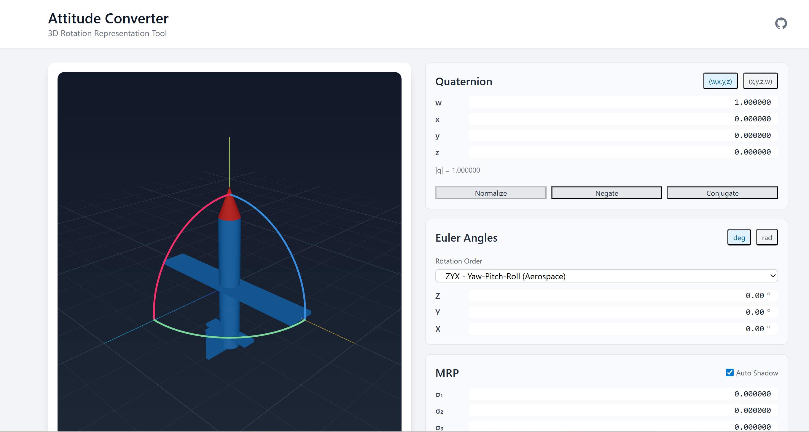

[English](./README.en.md)
# Attitude Converter

3D回転表現の相互変換ツール

[**デモ**](https://attitude-converter.tompython.com/)



## 機能

- **Quaternion** ⇔ **Euler Angles** ⇔ **MRP** ⇔ **Axis-Angle** ⇔ **Rotation Matrix**
- 12種類のオイラー角順序（ZYX, XYZ, ZXZ など）
- ジンバルロック検出・警告
- MRPシャドウセット自動切替
- インタラクティブ3Dビュー

## 技術スタック

- **Frontend**: Next.js, React Three Fiber, TypeScript
- **Core**: Rust → WebAssembly

## セットアップ

```bash
git clone https://github.com/chantakan/attitude-converter.git
cd attitude-converter

# WASMビルド
cd attitude-wasm
wasm-pack build --target web --release
cp pkg/attitude_wasm.js ../public/wasm/
cp pkg/attitude_wasm_bg.wasm ../public/wasm/
cd ..

# 起動
npm install
npm run dev
```

http://localhost:3000 でアクセス

## ライセンス

[MIT](./LISENCE)